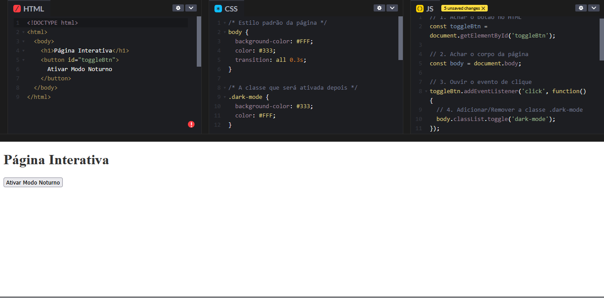
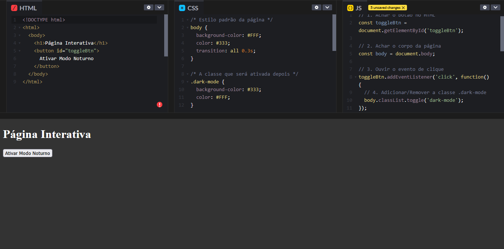

# A Tríade do Front-End
## Construindo uma Página Interativa com HTML, CSS e JavaScript

**Douglas Andrade**

---
<!-- _class: invert -->

## O que faremos hoje?

O nosso objetivo é entender na prática a sinergia entre as três linguagens fundamentais da web.

- **Meta:** Construir uma funcionalidade de "Modo Noturno" do zero.
- **Ao final:** Você será capaz de diferenciar o papel de cada tecnologia no resultado final.

---
<!-- _class: invert -->

## A Web como um Corpo Humano
<div class="columns">
<div>

-   #### **HTML: A Estrutura**
    * É o esqueleto que sustenta o conteúdo.<br>
    
</div>
<div>

-   #### **CSS: O Estilo**
    * São as roupas, cores e a aparência visual.<br><br>
    

</div>
<div>

-   #### **JavaScript: O Comportamento**
    * É o cérebro que controla as ações e a interatividade.
    
</div>
</div>

<style scoped>
.columns {
  display: grid;
  grid-template-columns: repeat(3, 1fr);
  gap: 1rem;
  /* Garante que todas as colunas se estiquem para ter a mesma altura */
  align-items: end; 
}

/* Transforma cada coluna em um contêiner flexível vertical */
.columns > div {
  display: flex;
  flex-direction: column;
  justify-content: space-between; /* MÁGICA ACONTECE AQUI */
  text-align: center;
  padding: 1rem;
}

.columns > div > h3 {
  margin-top: 0;
}

.columns img {
  max-width: 100%;
  height: 250px;
  object-fit: contain;
}

/* Regras para ajustar a fonte deste slide */
section {
  font-size: 24px;
}
section h3 {
  font-size: 1.2em;
}
</style>

---
<!-- _class: invert -->

## Passo 1: A Estrutura (HTML)
### O Esqueleto da nossa Página
```html
<!DOCTYPE html>
<html>
  <body>
    <h1>Página Interativa</h1>
    <button id="toggleBtn">
      Ativar Modo Noturno
    </button>
  </body>
</html>
```
---
<!-- _class: invert -->

## Passo 2: O Estilo (CSS)
### Vestindo a nossa Estrutura

```css
/* Estilo padrão da página */
body {
  background-color: #FFF;
  color: #333;
  transition: all 0.3s;
}

/* A classe que será ativada depois */
.dark-mode {
  background-color: #333;
  color: #FFF;
}
```

---
<!-- _class: invert -->

## Passo 3: O Comportamento (JavaScript)
### Dando Vida com o Cérebro

```javascript
// 1. Achar o botão no HTML
const toggleBtn = document.getElementById('toggleBtn');

// 2. Achar o corpo da página
const body = document.body;

// 3. Ouvir o evento de clique
toggleBtn.addEventListener('click', function() {
  // 4. Adicionar/Remover a classe .dark-mode
  body.classList.toggle('dark-mode');
});
```

---
<!-- _class: invert -->

## A Integração da Tríade

Como a mágica acontece? É um fluxo lógico:

1.  **AÇÃO:** O usuário clica no botão.
2.  **COMPORTAMENTO (JS):** O JavaScript "ouve" o clique e executa uma função.
3.  **MUDANÇA DE ESTRUTURA (HTML):** A função adiciona a classe `.dark-mode` ao `<body>` do HTML.
4.  **MUDANÇA DE ESTILO (CSS):** O CSS detecta a nova classe e aplica instantaneamente os estilos visuais a ela associados.

---
<!-- _class: invert -->

## Demonstração: Estado Inicial (Modo Claro)

Este é o visual da nossa página antes de qualquer interação do usuário. O CSS padrão está aplicado.



<style scoped>
img {
  max-width: 79%;
  object-fit: contain;
}
</style>
---
<!-- _class: invert -->

## Demonstração: Após o Clique (Modo Escuro)

Com um único clique, o JavaScript alterou o DOM, e o CSS, que já estava preparado, aplicando o estilo `.dark-mode` instantaneamente.



<style scoped>
img {
  max-width: 79%;
  object-fit: contain;
}
</style>

---
<!-- _class: invert -->

## Conclusão

Revisitando nossos objetivos, nós conseguimos:

**Diferenciar** o papel de cada linguagem.
**Estruturar** com HTML.
**Estilizar** com CSS.
**Aplicar comportamento** com JavaScript.

A união dessas três ferramentas é o que permite a criação de qualquer interface na web moderna.

---
<!-- _class: invert -->


# Obrigado!

## Perguntas?

<br>

### Material da aula disponível em:
####  https://github.com/profdouglas/aulafrontend


<style>
/* Altera o tamanho da fonte para todo o slide */
section {
  font-size: 28px; /* O padrão é ~30px. Experimente 26px, 28px, etc. */
}

/* Ajusta os títulos proporcionalmente ao novo tamanho base */
h1 {
  font-size: 2.2em; /* em = múltiplo do tamanho da fonte da section */
}
h2 {
  font-size: 1.6em;
}
</style>